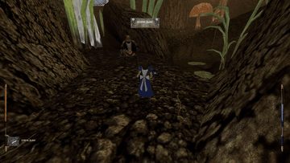
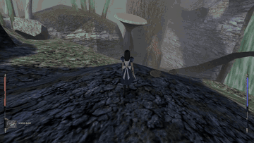
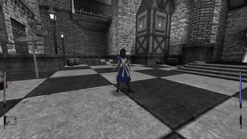

# Looking Glass — American McGee's Alice Re-Remaster

**Play the whole game, from the opening to the final boss, ending and credits.**
All **39 campaign visits**, including return visits, are playable in this
experimental Windows preview.

Looking Glass is an unofficial **re-remaster of American McGee's Alice**: it
brings the **2011 rerelease's game data** into a newly written, open-source Rust
engine with guided setup, configurable controller support and modern display
options. It uses your own compatible game files and runs independently of the
original game executable, gameplay DLL and Alice: Madness Returns.

**[Download for Windows — play the full campaign](https://github.com/skulitom/LookingGlass/releases/download/v0.32.0-preview.1/LookingGlass-Windows-x64-v0.32.0-preview.1.zip)** ·
[Watch the 54-second showcase](#gameplay-showcase) ·
[Report a bug](https://github.com/skulitom/LookingGlass/issues/new/choose)

**One download, three steps:** save the ZIP (10.4 MB), choose **Extract All**,
then open **Launch.cmd** in the extracted LookingGlass folder. Guided setup
handles the separate game files. The link above downloads the right Windows
package directly; no need to choose from a release file list.

This is an experimental prerelease, with remaining fidelity and device-testing gaps.
The project includes no original game data. You need your own compatible copy.

## Gameplay showcase

[](https://github.com/skulitom/LookingGlass/releases/download/v0.32.0-preview.1/LookingGlass-Preview-Showcase.mp4)

**[Watch or download the assembled 54-second video](https://github.com/skulitom/LookingGlass/releases/download/v0.32.0-preview.1/LookingGlass-Preview-Showcase.mp4)**

Combat and exploration, controller and display menus, and the three-step setup
in one showcase. Actual Windows preview footage at normal speed, with captions;
720p, 30 fps. **This recording is silent.**

## Why try Looking Glass?

The practical benefits are easier setup, flexible controls and a game engine
that can be inspected and improved. These conveniences are built into this
project:

| Feature | What it means for you |
| --- | --- |
| **Full playable campaign** | Start a new game and play all 39 story visits through the final boss, ending and credits, with campaign progress and saves carried between levels. |
| **Guided installation** | One setup window finds, optionally downloads, checks and unpacks compatible game files, then starts the game. No compiler, separate extractor or changes to the original executable are needed. |
| **Built-in controller support** | Play and navigate menus with an Xbox/XInput controller. Rebind buttons, adjust stick sensitivity and deadzones, and invert the camera. An active controller disconnect pauses play. |
| **Modern display and camera options** | Choose window resolutions including 1080p, 1440p and 4K, or borderless fullscreen at your desktop resolution. Adjust third-person camera distance, mouse sensitivity and look inversion in the settings. |
| **Easy chapter replay** | Browse all 39 story visits, including return visits, and choose a difficulty from the chapter menu. Each selection starts a fresh visit; normal exits carry your campaign forward. |
| **Save protection and recovery** | Four manual slots, quick save and a separate autosave have picture previews. Each slot keeps a previous validated copy, which the loader can recover if the current file is damaged. |
| **Source that can be improved** | The newly written engine code is available in this project under MIT. Contributors can inspect behavior, fix bugs and extend it, with automated gameplay and save checks to help catch regressions. |

Looking Glass retains the original artwork, models, music and voices from your
game files. Its focus is rebuilding the engine and gameplay with these practical
conveniences; visual and behavioral fidelity are still being refined.

## Recreated gameplay

- **Campaign progression:** story-ordered levels and return visits, quest items,
  puzzles, moving machinery and persistent world state.
- **Combat:** the weapon and power-up systems, enemy encounters and boss fights.
- **Traversal:** rope climbing and swinging, ledge grabs and pull-ups, swimming,
  currents and breath management.
- **Story and atmosphere:** scripted cameras and character performances,
  conversations, Cheshire hints, music, voices and positional sound effects.

These systems are implemented with remaining gaps documented below. They are
recreations of the original game's features, alongside the conveniences above.

## Current status

**The full campaign is playable; this re-remaster is still an experimental preview.**

All 39 campaign visits have been completed in automated native playthroughs:
three Easy and two Normal runs, including one uninterrupted fresh campaign.
The other four used earned checkpoints while fixes were developed. The ending
film and credits were also checked in the viewer. These results do not establish
complete visual, audio or original-game fidelity. See the
[campaign audit](docs/CAMPAIGN_RUN_AUDIT.md) and
[known issues](docs/KNOWN_ISSUES.md) for exact coverage and remaining work.

The current development build supports Windows x64, the English 2011 vanilla
data set, persistent campaign saves, keyboard/mouse and configurable controller
input. Other data editions and platforms have not been certified.

Expect remaining differences in cutscene staging, effects, materials and enemy
behavior, plus a reported waterside rope-grab issue. Broader PC and audible
playthrough validation remain unfinished. Looking Glass uses its own save
format; saves from the original game cannot be imported.

## Gameplay

Short clips recorded in the Windows preview, at normal speed. These recordings
are **silent**. Select a preview to watch or download the full video.

| Dry Landing | Pool of Tears | Pale Realm |
| --- | --- | --- |
| [](docs/media/gameplay/dry-landing.mp4) | [](docs/media/gameplay/pool-of-tears.mp4) | [](docs/media/gameplay/pale-realm.mp4) |
| Cards combat · [Watch video, 11 seconds](docs/media/gameplay/dry-landing.mp4) | Waterfall exploration · [Watch video, 10 seconds](docs/media/gameplay/pool-of-tears.mp4) | Chess town exploration · [Watch video, 14 seconds](docs/media/gameplay/pale-realm.mp4) |

Full videos are 720p. [Recording details](docs/media/gameplay/README.md).

## Install and play

1. **[Download for Windows](https://github.com/skulitom/LookingGlass/releases/download/v0.32.0-preview.1/LookingGlass-Windows-x64-v0.32.0-preview.1.zip)** (10.4 MB). This downloads the one ZIP you need.
2. Right-click the ZIP, choose **Extract All**, and open the extracted folder.
   Keep it somewhere writable, such as `Documents\LookingGlass`.
3. Double-click **Launch.cmd**. On the first launch, a setup window finds existing
   game files or offers to download the compatible files from Internet Archive.
4. Select **Set up**. Setup checks and unpacks the files, then opens the game.
   Next time, just open **Launch.cmd** or your optional desktop shortcut.

Choose **New Game** to play the full campaign in story order, or use the chapter
chooser to jump into a particular visit.

No commands, Rust, separate 7-Zip installation or administrator access are needed
for the Windows package. Allow **3 GB of free space**; the optional game-data
download is about **933 MB**. Setup needs internet access only if you choose Download.

**Where do the game files come from?** The supported file is
**Alice1_2011_vanilla.7z** from
[American McGee's Alice (2011) on Internet Archive](https://archive.org/details/alice_202106).
Setup can download it for you, or you can use **Choose archive** / **Choose folder**
for files you already have. Use game files you are entitled to use. Original game
data is not included in the Looking Glass release.

See [installation and troubleshooting](docs/INSTALL.md), including updates and
building from source. [Release notes and checksums](https://github.com/skulitom/LookingGlass/releases/tag/v0.32.0-preview.1)
describe the exact package and its verification limits.

Use the in-game settings to view or change controls. **Esc** opens the menu,
**F5/F9** quick-save/load, and **Tab** opens the chapter chooser. Choosing a
chapter starts a new visit; use normal exits to carry campaign progress.

## Build and contribute

```powershell
cargo test --locked
cargo build --release --locked
.\Setup.cmd
.\Launch.cmd
```

The minimum Rust version is declared in [Cargo.toml](Cargo.toml). The dependency
versions are locked. Building does not fetch original game data.

[Contribution guidance](CONTRIBUTING.md) explains the source boundary, testing
and bug-report requirements. Development shortcuts are under
[tools/launchers](tools/launchers/README.md); ordinary play uses root `Launch.cmd`.

## Documentation

- [Installation](docs/INSTALL.md) and [controls](docs/CONTROLS.md)
- [Campaign route audit](docs/CAMPAIGN_RUN_AUDIT.md) and [known issues](docs/KNOWN_ISSUES.md)
- [Validation](docs/VALIDATION.md) and [save behavior](docs/SAVES.md)
- [Release preparation](docs/RELEASE_PLAN.md)
- [Earlier development notes](docs/DEVELOPMENT_HISTORY.md)

## License and independence

Newly authored source and documentation use the [MIT license](LICENSE-MIT).
Original game assets, gameplay footage and third-party components are excluded
from that license.
This project is independent and is not an official or endorsed release.
See [LEGAL.md](LEGAL.md) for the existing provenance and distribution assessment.
